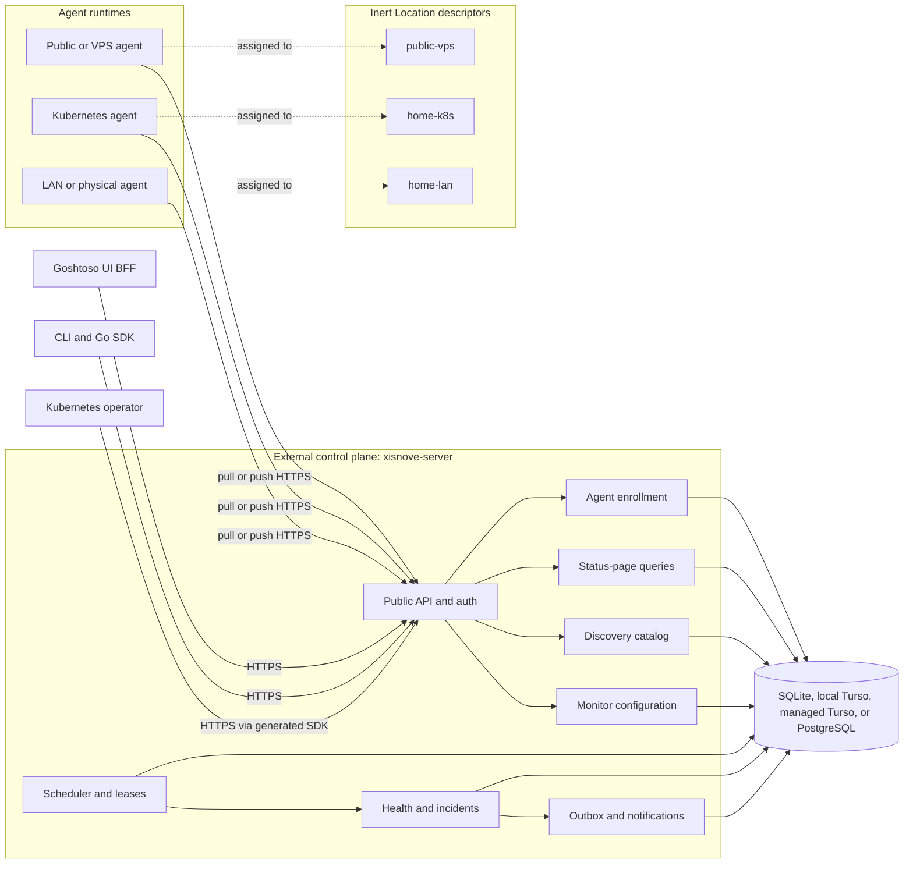

# Xisnove Canonical Monitoring Design

Status: canonical architecture; replaces the monitor/location model from 2026-07-24

Date: 2026-08-15

## Summary

Xisnove is an API-first, self-hosted monitoring service written in Go. It
combines a public OpenAPI contract, a generated Go SDK, a CLI, a Goshtoso-based
UI BFF, remote probing agents, and optional Kubernetes-native reconciliation
and discovery.

The architecture is a modular hexagonal control plane backed only by a
relational database. `Location` is an inert descriptor: it has no health and
does no work until it is associated with a `Monitor`. An `Agent` is a separate
runtime assigned to a Location; it may pull leased work or push observations
through an authenticated endpoint. A MonitorLocation association activates a
Location for that Monitor and resolves the effective execution policy.

Monitors and Locations share a common observable read model, but they retain
different write semantics. A Monitor may be direct (HTTP, TCP, DNS, or another
probe) or composite (a monitor of other monitors). This lets Xisnove represent
services, platforms, and infrastructure composition without introducing a
separate `Service` entity.

Kubernetes is a client and desired-state surface, not a database. A separate
operator reconciles `Monitor` and `Agent` custom resources through the same
public API used by the CLI and UI. Observations, state ticks, incidents,
notification delivery, and audit state remain in SQLite, Turso, or PostgreSQL.

This document is the canonical monitoring model. Existing implementation
milestones remain useful delivery slices, but any older monitor/location
semantics are superseded here and must be migrated through the public contract.

## Open Core product boundary

### Architectural compatibility required now

Xisnove is developed toward an Apache 2.0 Open Core model. The canonical public
repository and Go module remain `github.com/araihu/xisnove`; they are never
renamed to a separate `core` module. This repository is a complete,
single-tenant, self-hosted monitoring product rather than a reduced community
edition.

Its domain model, application services, infrastructure ports, OpenAPI contract,
SDK, and adapter conformance utilities form an intentional Go extension
surface. The importable packages are rooted at:

```text
github.com/araihu/xisnove/domain
github.com/araihu/xisnove/application
github.com/araihu/xisnove/application/port
github.com/araihu/xisnove/contracttest
```

Self-hosted adapters and composition stay under `internal/adapters` and
`cmd/xisnove-server`. The server command is one composition root, not the owner
of application behavior. External modules extend Xisnove with ordinary Go
interfaces, constructors, and manual dependency injection; Go plugins,
edition build tags, and forks of the core domain are not extension mechanisms.

Before the repository is presented as Apache-licensed, the full Apache 2.0
license and any required notices must be committed and release checks must
verify them.

### Private SaaS implementation deferred

A future proprietary `github.com/araihu/xisnove-cloud` repository may import
the public module and supply separate composition roots and adapters for
multi-tenant authentication and authorization, billing, tenant-aware
persistence, scalable analytics, and managed infrastructure. That repository
is not created or implemented by v1.

The public core remains SaaS-blind: it does not add tenant, organization,
workspace, subscription, Stripe, or entitlement concepts merely to anticipate
the hosted product. A future cloud boundary may place a validated tenant scope
in `context.Context`; proprietary adapters must extract it and fail closed when
it is missing. Context propagation enables that design but is not an
authorization mechanism.

### Single-tenant self-hosted v1 remains the product scope

All behavior described by this specification remains available to one
self-hosted installation without proprietary code or hosted services. Building
or operating the proprietary SaaS edition is not a v1 deliverable. Open Core
compatibility must not weaken the local-administrator flow, supported storage
profiles, agents, operator, notifications, UI, CLI, or deployment resources.

## Goals

- Provide HTTP(S), TCP, and DNS synthetic monitoring from multiple network
  perspectives.
- Keep the public OpenAPI document as the canonical application contract.
- Generate a strict Go server boundary and public Go SDK with `oapi-codegen`.
- Offer a thin CLI and a server-rendered Goshtoso UI BFF without duplicating
  domain rules.
- Run the control plane outside the primary monitored failure domain.
- Reach private, Tailscale-only, physical, VPS, and Kubernetes targets through
  outbound-only agents.
- Keep Locations inert until a MonitorLocation association activates them.
- Support pull and push observation paths without changing health semantics.
- Represent services and platforms as composite Monitors rather than a separate
  Service entity.
- Preserve lifecycle, health, reason, actor, user-action, and causal history for
  every state tick.
- Discover Kubernetes services and routes with read-only RBAC, then require
  explicit user promotion before monitoring them.
- Support simple single-node deployments and multi-replica managed
  deployments without changing domain semantics.
- Deliver reliable multi-channel notifications with a transactional outbox,
  a pinned Shoutrrr transport, and a first-class Alertmanager adapter.
- Ship supported resources for raw binaries, Docker Compose, OCI images, and
  Kubernetes/Helm deployments.

## Non-goals for v1

- Multi-tenant organizations, workspaces, billing, or hosted SaaS account
  management.
- OIDC or SAML login.
- ICMP probing, because it introduces raw-socket and deployment privilege
  requirements.
- Browser scripting, full transaction monitoring, or arbitrary user-supplied
  probe code.
- Automatic promotion of discovered resources into monitors. Agent enrollment
  may optionally create one idempotent, agent-managed heartbeat Monitor for
  convenience.
- Kubernetes API/etcd as a control-plane persistence backend.
- A CRD for every result, incident, notification, or delivery attempt.
- A Kubernetes Job per probe or notification.
- Multiple public status pages, custom status-page domains, or advanced
  branding.
- Recurring maintenance schedules.
- Scheduled automatic agent-credential rotation.
- Direct Vault, OpenBao, External Secrets Operator, or cloud secret-manager
  API integrations.
- Redis, Kafka, NATS, or another required queue.
- Building, provisioning, billing, or operating a proprietary SaaS edition.
- SaaS tenant, organization, workspace, subscription, or entitlement fields in
  the public core domain.

## Success criteria

The canonical design is successful when:

1. A control plane running on a cloud VPS or separate cluster can monitor public
   endpoints while agents monitor LAN, Tailscale, physical-node, and Kubernetes
   paths.
2. Losing the monitored homelab does not erase or hide its status, incident
   history, or pending notifications.
3. UI, CLI, operator, and agent functions use only the published API and
   generated SDK contracts.
4. Duplicate scheduling, lease expiry, repeated uploads, process crashes, and
   notification retries do not create duplicate state transitions.
5. SQLite and local Turso operate safely with one active server, while managed
   Turso and PostgreSQL can support multiple stateless server replicas.
6. A Kubernetes discovery agent can catalog useful targets without permission
   to read Secrets or silently create monitors.
7. Releases include verifiable binaries, OCI images, Helm charts, Compose
   resources, CRDs, upgrade notes, checksums, signatures, SBOMs, and provenance.
8. An external Go module can import the public domain, application, ports, and
   contract tests, inject a replacement adapter, and construct an application
   service without importing self-hosted implementation details.
9. Pausing a Monitor or MonitorLocation produces an auditable administrative
   state and causes dependent Monitors to project `unknown` with a causal reason.
10. Every health transition can distinguish infrastructure failure, dependency
    uncertainty, and maintenance through a stable reason code and actor/action
    provenance.

## Homelab fit

The reference deployment has several distinct failure and reachability domains:

- public DNS and endpoints managed through Cloudflare;
- a Kubernetes cluster containing amd64 and arm64 nodes;
- physical LAN nodes and services;
- VPS nodes reachable over public networks or Tailscale;
- split public/internal DNS and private service addresses;
- an existing Prometheus, Loki, Alloy, and Alertmanager stack.

Xisnove complements that telemetry stack with active reachability and
desired-state monitoring:

- a public/VPS Location, served by one or more Agents, observes public
  Cloudflare records and endpoints;
- a LAN Location, served by one or more Agents, observes physical hosts,
  private DNS, and Tailscale paths;
- a Kubernetes Location, served by an edge Agent, discovers cluster services
  and observes their in-cluster routes;
- Alertmanager remains available as a semantic notification sink, while
  Shoutrrr provides embedded delivery channels.

The recommended control plane is outside the home cluster: a cloud service,
external VPS, or separate Kubernetes cluster. It must not depend on the primary
homelab to report that the homelab is unavailable.

## System architecture



The server is one deployable in v1. Its internal modules share a relational
transaction boundary, while ports preserve the option to split deployments
later. Multiple server processes may run the same roles when the database mode
supports them; database leases coordinate schedules and workers.

Locations are inert descriptors and do not execute probes or acquire health by
themselves. A MonitorLocation association activates a Location for one Monitor
and may be paused independently. A simple installation runs an Agent beside the
control plane and assigns it to a default Location. Larger installations add
remote Agents without changing the observable or health contracts.

Agents are separate runtimes, never Locations. Each Agent has a Location
assignment, capabilities, and a transport mode (`pull`, `push`, or `webhook`).
Agent creation may request an idempotent managed heartbeat Monitor, but the
heartbeat Monitor remains a normal Monitor and the Agent remains a separate
identity.

The following rules are architectural invariants:

- OpenAPI is the only application boundary for UI, CLI, SDK, operator, and
  agents.
- Agents have no database credentials and accept no inbound control-plane
  connection.
- The operator never imports server internals or accesses the server database.
- Domain code does not import HTTP, SQL driver, sqlc, Kubernetes, Goshtoso, or
  notification-provider types.
- The relational database is the durable coordination point for every
  asynchronous action.

## Repository and module boundaries

The initial monorepo uses a Go workspace for local development while keeping
independently versionable modules:

```text
/
├── api/
│   └── openapi.yaml
├── cmd/
│   └── xisnove-server/
├── internal/
│   ├── domain/
│   ├── application/
│   ├── ports/
│   └── adapters/
├── sdk/
├── db/
│   ├── migrations/
│   ├── queries/
│   └── generated/
├── agent/
│   ├── go.mod
│   └── cmd/xisnove-agent/
├── operator/
│   ├── go.mod
│   └── cmd/xisnove-operator/
├── cli/
│   ├── go.mod
│   └── cmd/xisnove/
├── ui/
│   ├── go.mod
│   └── cmd/xisnove-ui/
├── charts/
│   ├── xisnove/
│   └── xisnove-edge/
├── deploy/
│   ├── compose/
│   ├── raw/
│   └── systemd/
└── go.work
```

The root module is `github.com/araihu/xisnove`. It owns the server, public
contract, SDK, public domain/application/port packages, public adapter contract
tests, self-hosted persistence adapters, migrations, and notification adapters.

The root layout includes these intentional extension packages:

```text
├── domain/                 # public entities, values, and pure transitions
├── application/            # public use cases and service constructors
│   └── port/               # public infrastructure and unit-of-work ports
├── contracttest/           # public adapter behavioral suites
├── internal/adapters/      # self-hosted implementations
└── cmd/xisnove-server/     # self-hosted composition root
```

Each child module depends only on published packages that it legitimately
consumes:

- `agent/` contains probing, Kubernetes discovery/watch, enrollment, leasing,
  heartbeat, and batched upload.
- `operator/` contains CRDs and controllers and uses only the public SDK.
- `cli/` contains thin commands over the SDK, named API profiles, and human or
  structured output.
- `ui/` contains the Goshtoso BFF, templ/HTMX pages, and UI-specific
  presentation models. It uses only the SDK.

CI tests each module both through `go.work` and with `GOWORK=off`, preventing a
release from accidentally depending on a local workspace replacement.

## Hexagonal ownership

### Domain

The domain layer owns entities, value objects, invariants, and pure state
transitions:

- observable identity and labels for Monitors and Locations;
- inert Location and MonitorLocation activation rules;
- monitor composition edges and cycle prevention;
- location policy defaults and per-association policy resolution;
- typed probe definitions;
- per-association threshold state and lifecycle;
- aggregate health for direct and composite Monitors;
- state-tick reason, actor, user-action, and causal provenance;
- incident opening, severity change, and recovery;
- pause, resume, and maintenance decisions;
- notification event identity.

It receives explicit time values and has no global clock, storage, network, or
framework dependency.

The domain is public and imports neither application code nor `internal`
packages. SaaS-specific identity, billing, and entitlement concepts do not
enter it.

### Application

The application layer orchestrates commands and queries:

- monitor and location management;
- agent enrollment, credential rotation, and revocation;
- run scheduling and leasing;
- result ingestion and health projection;
- incident and outbox transactions;
- discovery candidate ingestion and promotion;
- status-page queries;
- retention, aggregation, and cleanup.

Application services depend on ports for persistence, transactions, clock,
random IDs, credential hashing, encryption, notification transport, and audit
recording.

All application services and port operations accept the caller's
`context.Context` first and propagate it unchanged through the call chain.
Application code never replaces an incoming context with
`context.Background()`. Constructors require context only when construction
performs bounded I/O.

Ports consumed by application behavior live in `application/port`. The
transactional boundary remains coarse enough to express consistency-sensitive
operations atomically:

```go
type UnitOfWork interface {
    View(context.Context, func(context.Context, Repositories) error) error
    Transact(context.Context, func(context.Context, Repositories) error) error
}
```

The callback receives the same context and a transaction-scoped repository
set. Observation ingestion can therefore commit the Observation, health
transition, StateTick, Incident mutation, IncidentEvent, audit event, and
notification outbox rows as one unit.

Historical analytics is a separate concern. The operational UnitOfWork owns
configuration, scheduling, leases, result idempotency, health, Incidents,
outbox, and audit. A future `ObservationArchive` or `UptimeAnalytics` port may
feed ClickHouse or another OLAP system asynchronously from committed events;
an analytical database never replaces the transaction-capable operational
store.

### Adapters

Adapters translate external types at the boundary:

- strict HTTP handlers generated from OpenAPI;
- sqlc repositories and migrations;
- SQLite, Turso, and PostgreSQL drivers;
- cryptography and secret-file loading;
- Shoutrrr and Alertmanager notification transports;
- system clock and ID generation.

Generated API and sqlc types never leak into domain packages.

Public application/domain packages cannot import self-hosted adapters.
Dependency tests enforce this direction, while an external-module compile
fixture proves the extension surface does not accidentally rely on Go
`internal` visibility.

## Public API and generation

`api/openapi.yaml` is the canonical source. As of 2026-07-24, the pinned
baseline is:

- OpenAPI 3.1.2;
- `oapi-codegen` v2.8.0, the newest stable release verified during design and
  the first release with OpenAPI 3.1 support.

Before implementation begins, automation must recheck the newest stable
`oapi-codegen` version and use the newest OpenAPI revision it officially
supports. Exact tool, runtime, and schema versions are committed. Dependency
automation may propose newer stable pins, but generated diffs require review.

Generation produces:

- strict server interfaces and transport models;
- a public typed Go client;
- an embedded copy of the served contract;
- ergonomic SDK helpers around pagination, authentication, and common options.

Generated code is committed. A clean-generation check fails CI on drift.
Authentication and authorization are explicit middleware; generated security
declarations do not enforce access by themselves.

The one contract contains separately tagged surfaces:

- management;
- public status;
- agent protocol;
- operator provisioning.

Each surface has an explicit security scheme and scope. Operation IDs are
stable, resource names are plural, cursors are opaque, and mutation endpoints
accept idempotency keys where a network retry could otherwise duplicate work.

Errors use `application/problem+json` following RFC 9457. Every problem has a
stable type URI, machine-readable code, correlation ID, and optional field
errors. Internal error strings and secrets are never exposed.

The initial resource families are:

- sessions and API tokens;
- observable Monitors, composite edges, and MonitorLocation assignments;
- inert Locations, Agents, and Agent transport bindings;
- enrollment tokens and credential rotation;
- agent work leases, heartbeats, observations, and batched results;
- health summaries, state ticks, and incidents;
- notification channels, routes, deliveries, and replay;
- discovery candidates and promotion;
- maintenance intervals;
- the single public status page.

## Product scope and authentication

V1 is one self-hosted workspace with one bootstrapped local administrator.
There is no default credential. The administrator is created through an
explicit bootstrap command using an interactive password or a rotation-safe
password file.

The control plane issues:

- revocable administrator sessions;
- scoped API tokens for CLI and integrations;
- short-lived, one-time agent enrollment tokens;
- scoped, revocable per-agent credentials;
- a narrowly scoped operator provisioning credential.

High-entropy tokens are displayed once and stored only as verification hashes.
Authorization is deny-by-default and checked per operation.

The UI BFF exchanges administrator credentials with the control plane and keeps
the returned opaque session credential in a Secure, HttpOnly, SameSite cookie.
The credential is never exposed to browser JavaScript. State-changing browser
requests require CSRF protection. The control plane remains the owner of session
expiry and revocation.

OIDC and multi-tenant organizations are deferred, but identity and workspace
IDs remain explicit at application boundaries where doing so avoids a
destructive future migration. V1 does not expose multi-workspace behavior.

## Monitor model

### Common observable contract

Monitor and Location are different domain entities but share a common
observable read model. The read model exposes a stable ID, name, kind, labels,
administrative lifecycle, effective health, last transition time, reason, and
causal provenance. It is a common projection, not permission to collapse
Monitor configuration and Location descriptors into one write schema.

`paused` and `disabled` belong to the administrative lifecycle. `pending`,
`up`, `degraded`, `down`, and `unknown` belong to health. An unassociated
Location has no health state; it is inactive rather than `unknown`.

### Monitor

A Monitor is a logical health evaluator. It may be direct or composite. A direct
Monitor evaluates a typed probe; a composite Monitor evaluates other Monitors
through explicit composition edges. A service, platform, or infrastructure
component is therefore represented by a composite Monitor rather than a
separate `Service` entity.

A Monitor contains:

- stable ID, name, description, labels, and display order;
- direct probe or composite-child definition;
- administrative lifecycle (`active`, `paused`, or `disabled`);
- monitor-wide policy defaults;
- assigned required and optional MonitorLocations;
- composition policy for child Monitors;
- public-status-page inclusion.

Each composition edge identifies a child Monitor, whether that child is
required, its impact policy, and how Locations map across the edge. The default
mapping is the same active Location; an explicit edge may instead consume the
child's aggregate state or a selected child Location. Cycles are rejected at
write time, and labels never create implicit dependencies.

Fixed intervals remain the default rather than arbitrary cron expressions. A
Monitor may define default interval, timeout, jitter, failure threshold, and
recovery threshold values. The effective values are resolved for each active
MonitorLocation, so one Monitor may be observed with different operational
policies from different Locations.

Probe configurations are discriminated OpenAPI schemas, not arbitrary JSON:

- HTTP(S): method, URL, headers, bounded body, redirect policy, expected status
  ranges, body contains/does-not-contain assertions, and TLS-expiry threshold;
- TCP: host, port, connection timeout, and optional bounded send/expect data;
- DNS: resolver selection, name, record type, expected values, and timeout.

Sensitive request values are secret references or encrypted fields and are
redacted from logs and API responses. ICMP is deferred.

### Location

A Location is an inert descriptor for a possible observation scope or failure
domain. It can be created arbitrarily or emitted speculatively by discovery;
neither action starts work or creates health. Examples are `public-vps`,
`home-k8s`, `home-lan`, a Kubernetes cluster, a VM, a bare-metal host, or a
Docker environment.

A Location may carry a network address (IPv4, IPv6, or hostname), a default
probe protocol (`http`, `tcp`, or `dns`), labels, a failure-domain description,
an optional Agent selector, and policy defaults such as interval, timeout,
jitter, and thresholds. Discovery-only failure-domain locations may omit the
address until an address is known. These are templates, not immutable
requirements. A Monitor or its MonitorLocation association may override them.

The minimal useful policy defaults are interval `60s`, timeout `5s`, failure
threshold `3`, and recovery threshold `2`. The API returns these effective
defaults even when the create request omits the policy object, so a location can
be assigned to several monitors without repeating boilerplate.

The effective policy precedence is:

```text
system defaults < Location defaults < Monitor defaults < MonitorLocation override
```

If probe kind or probe definition is allowed to vary by Location, the resolved
kind is part of the MonitorLocation execution profile. A Monitor must not hide
that distinction behind one global kind in its read model.

### Agent and MonitorLocation

An Agent is a separate runtime identity. It belongs to one Location, advertises
probe and discovery capabilities, records liveness, and uses `pull`, `push`, or
`webhook` transport. Multiple Agents may serve the same Location. A Location
selector may resolve a group of compatible Agents, with an explicit selection
or quorum policy rather than an implicit tag meaning.

`MonitorLocation` is the activation boundary. It assigns a Monitor to a
Location, resolves the effective policy, marks the assignment required or
optional, and may be paused independently of both the Monitor and the base
Location. Optional location state is visible but does not gate aggregate health.

Pausing a Monitor stops all of its active assignments. Pausing a
MonitorLocation stops only that execution scope. Neither action is an
infrastructure failure; dependent Monitors project `unknown` with an
administrative reason such as `dependency_paused` or `location_paused`.

Agent creation may request an idempotent, agent-managed heartbeat Monitor for
convenience. The heartbeat remains a normal Monitor; the Agent does not become
a Location and the generated Monitor is linked to the Agent for provenance.

### CheckRun, lease, and Observation

The scheduler creates one CheckRun for each active direct MonitorLocation,
assigned Location, and scheduled time. A unique
`(monitor_id, location_id, scheduled_for)` key prevents duplicates. Paused or
disabled assignments do not create new runs.

A CheckRun progresses through available, leased, and resolved states. The lease
records an agent, attempt number, opaque lease token, and database-time expiry.
A compatible Agent obtains work through bounded REST long-poll or an equivalent
push-capable work path. If it crashes or fails to report, the expired run
becomes claimable again. Agents never own the schedule.

After scheduler downtime, catch-up is bounded per monitor. Missed intervals
beyond the configured catch-up window are summarized as scheduler lag rather
than replayed into an unbounded probe storm.

Every pull result and push report is normalized into an immutable Observation
containing:

- observation and optional run IDs;
- monitor and location IDs;
- optional reporting Agent ID and transport mode;
- start, finish, and receipt timestamps;
- outcome and structured error class;
- total latency and protocol-specific timings;
- assertion outcomes;
- a bounded, redacted diagnostic sample;
- an idempotency key and correlation metadata.

Pull `ProbeResult` is the execution-specific form of an Observation. The first
valid observation resolves a run. Repeated or late uploads return a successful
duplicate acknowledgement and cannot trigger a second projection or incident
transition.

Agents batch observations and retain a bounded in-memory retry queue until the
server acknowledges each item. A process crash may discard that queue, after
which a pull lease expires or a push observation is retried idempotently. A
durable offline Agent spool is deferred.

## Health and incidents

Each active MonitorLocation has a durable health projection. Observations apply
the resolved consecutive failure and recovery thresholds. A location becomes
stale when it misses its expected schedule plus the maximum probe/lease or
push-heartbeat timeout; the exact deadline is stored so all replicas agree.

An unassociated Location has no health projection. A paused Monitor or
MonitorLocation has administrative lifecycle `paused`; it is not itself a
probe failure. A dependent Monitor receives a projected `unknown` with a
reason such as `dependency_paused`, `monitor_paused`, or `location_paused`.
When an Agent loses heartbeat, its Agent health becomes `down` after the
configured TTL, while observations that require that Agent become `unknown`
with reason `agent_disconnected`.

Required locations roll up deterministically in this order:

1. Any required location missing, paused, or stale after its grace period
   produces `unknown`.
2. All required locations passing produces `up`.
3. All required locations failing produces `down`.
4. A fresh mixture of passing and failing required locations produces
   `degraded`.

Initial `pending` state does not notify. Optional locations are reported but do
not change the aggregate state. Composite Monitors apply the same explicit
policy to child Monitors; they never infer a Service state from an undeclared
relationship.

Every health or lifecycle evaluation appends an immutable StateTick with:

- subject kind and ID;
- resulting lifecycle and health;
- stable `reason_code`;
- action ID for the state evaluation (with a linked `user_action_id` when a
  user initiated pause, resume, maintenance, or another explicit action);
- actor kind and ID (`user`, `system`, or `agent`);
- occurrence time, observation ID, and optional causal tick/dependency ID.

Reason codes distinguish facts such as `probe_failure`, `probe_timeout`,
`stale_observation`, `agent_disconnected`, `dependency_unknown`,
`dependency_paused`, `paused_by_user`, and `maintenance`. A reason is never
reconstructed from free-form text after the fact.

There is at most one active Incident per Monitor. A transition from a healthy
state to `degraded`, `down`, or post-grace `unknown` opens an Incident. State and
severity changes append IncidentEvents to it. `down` is critical;
`degraded` and agent-unavailable `unknown` are warning states. Administrative
unknown caused by an intentional pause or maintenance is recorded and visible
but does not masquerade as an infrastructure failure. Recovery to `up` closes
the Incident.

Observation, health projection, StateTick, Incident transition, audit entry,
and all required notification outbox records commit in one transaction.
Current projections are rebuildable from immutable observations and StateTicks,
but are stored for efficient reads.

## Scheduling, leasing, and failure handling

The scheduler, agent work dispatcher, result projector, retention worker, and
notification worker all use database-backed leases or atomic claims. No
in-memory ownership is required for correctness.

All claims use database time, short transactions, and compare-and-set updates.
Workers are safe to run in every eligible server replica. A crash requires no
cleanup: leases expire and another worker resumes the work.

Shutdown behavior is:

1. fail readiness and stop claiming new work;
2. stop accepting new long-polls;
3. allow bounded in-flight work to finish;
4. release a lease when safe, otherwise let it expire;
5. close network listeners and database connections.

Liveness detects a wedged process. Readiness fails when required persistence or
schema compatibility is unavailable.

## Persistence profiles

All persistent control-plane state is relational. Kubernetes API/etcd is never
a datastore adapter.

### SQLite

- Uses a CGO-free `database/sql` driver and WAL mode.
- Supports one active Xisnove server process in v1.
- Uses bounded write transactions and cleanup batches.
- Has a documented online-safe backup and restore process.
- Is the default for raw and Compose installations.

### Local Turso Database

- Uses `tursogo` through `database/sql`.
- Uses the Rust Turso Database engine for local or explicit push/pull sync.
- Shares the SQLite-compatible schema and sqlc query family.
- Supports one active Xisnove server process in v1.
- Is marked evolving until the upstream engine and required SQL surface pass
  the full Xisnove persistence conformance suite.
- Sync is optional and is not used as a distributed lease coordinator.

### Managed Turso Cloud

- Uses `libsql-client-go` for remote `database/sql` access.
- Supports multiple stateless Xisnove server replicas against one managed
  database.
- Uses the SQLite-compatible schema and sqlc query family.
- Assumes Turso Cloud's current production libSQL engine and serialized writer;
  work claims and incident transactions remain short and retry lock conflicts.
- Does not assume local sync replicas can coordinate leases.
- Treats Turso Cloud primary/replica instances, durability, and failover as
  managed-service responsibilities. Xisnove uses the database endpoint and
  does not couple scheduling correctness to the provider's replica topology.

Turso Cloud and the local Rust Turso Database engine are distinct persistence
profiles. As of the design date, Turso Cloud runs libSQL and plans to integrate
the newer engine later.

### PostgreSQL

- Uses pgx and a separately generated sqlc package.
- Supports multiple API, scheduler, projection, and notification worker
  replicas.
- Is the reference self-managed high-availability profile.
- Uses PostgreSQL-native atomic claiming while preserving the application-port
  behavior shared by every adapter.

There are two generated SQL families: SQLite-compatible and PostgreSQL.
Adapter mapping prevents driver-specific UUID, timestamp, JSON, and nullable
types from escaping into the domain.

Every schema uses a normal `schema_migrations` table rather than
`PRAGMA user_version`, keeping migration behavior portable to Turso Cloud.

## Notification architecture

Xisnove owns notification semantics:

- routing by monitor labels, event type, and severity;
- template selection and rendering;
- deduplication;
- timeout and retry policy;
- audit history;
- secret references;
- manual replay.

The embedded multi-channel transport is
`github.com/nicholas-fedor/shoutrrr`, pinned to a reviewed stable release. The
design baseline is v0.16.2. Before implementation, the newest stable fork
release is reviewed and pinned.

Shoutrrr remains behind a `NotificationTransport` port. Its sender API does not
provide `context.Context`, so Xisnove enforces injected HTTP-client timeouts,
worker deadlines, bounded concurrency, and egress policy outside the library.

Alertmanager is a separate first-class semantic adapter rather than a Shoutrrr
URL. This lets the homelab continue using its existing routing, inhibition, and
Discord integration.

For each IncidentEvent, routing creates immutable outbox rows containing a
render-input snapshot. A uniqueness key across event, route, and channel
prevents duplicates. Workers claim due rows, record every attempt, and retry
transient failures with capped exponential backoff and jitter. Permanent
failure is visible and manually replayable. Provider failure never rolls back
or hides the Incident.

Because every supported backend is relational, the transactional outbox is
mandatory. Kubernetes Jobs are not used for notification delivery.

## Maintenance and retention

Xisnove supports one-off and indefinite maintenance intervals with an explicit
mode:

- `pause` stops a Monitor or MonitorLocation from scheduling or accepting new
  observations. Dependents project `unknown`, and the administrative reason is
  recorded in StateTicks without being mislabeled as infrastructure failure;
- `suppress_notifications` keeps observations and health running while
  suppressing matching notification deliveries.

Pause and resume are user actions with immutable action IDs. If a paused
Monitor remains unhealthy when it resumes, Xisnove emits a fresh transition so
the condition is not silently lost. Ending notification-only maintenance also
creates the existing post-maintenance transition when the condition remains
unhealthy.

Recurring maintenance schedules are deferred.

Default retention is:

- raw ProbeResults: 30 days;
- normalized Observations and StateTicks: 30 days by default, subject to the
  same bounded retention policy;
- daily uptime aggregates: 13 months;
- Incident and IncidentEvent history: retained until explicit deletion;
- delivery attempts and audit events: retained with their Incident unless an
  administrator applies a documented privacy cleanup.

Aggregation and cleanup use bounded batches to avoid long SQLite or libSQL
write locks.

V1 exposes one public status page. Only explicitly selected observable roots
appear. The page shows current aggregate state, active incidents, and recent
uptime history; composite children and Location context are available through
the selected observable detail. Multiple pages, custom domains, and advanced
branding are deferred.

## Agent protocol and security

The single `xisnove-agent` binary advertises independently enabled
capabilities:

- HTTP, TCP, and DNS probe execution;
- Kubernetes discovery;
- Kubernetes watch-derived catalog updates.

An administrator or operator creates a short-lived one-time enrollment token.
The agent exchanges it for a scoped, revocable credential and never receives
database access.

The steady-state protocol is:

1. heartbeat with identity, version, Location, capabilities, transport, and
   credential generation;
2. bounded REST long-poll for compatible work when transport is `pull`;
3. local probe execution under Agent policy;
4. idempotent batched Observation upload, or push/webhook delivery when
   transport is `push` or `webhook`;
5. discovery-candidate upsert batches when discovery is enabled.

Heartbeat liveness is independent of probe observations. A missed heartbeat
changes Agent health after its configured TTL and projects `unknown` into
dependent MonitorLocations; it never fabricates a target probe failure.

Agent policy constrains schemes, ports, CIDRs, redirect count, DNS
re-resolution, timeout, response bytes, concurrency, and upload batch size.
LAN locations may explicitly allow private address ranges. Cloud metadata and
link-local destinations are denied by default. Redirects are revalidated
against the same policy to limit SSRF.

When a probe needs a credential, the control plane resolves or decrypts it only
while building the leased work payload. It sends the minimum required value to
the assigned agent over authenticated HTTPS. The agent keeps it only for the
run and never writes it to logs, discovery records, results, or local storage.

Probe results retain structured assertion failures and bounded redacted
samples, never entire response bodies. Request and response secrets are
redacted before logging or persistence.

## Secrets and credential rotation

V1 secret inputs support:

- environment variables;
- files that can be reread safely after atomic replacement;
- Helm `existingSecret` references.

Vault Agent, OpenBao Agent, CSI drivers, and External Secrets Operator may
materialize files or Kubernetes Secrets. Xisnove does not call their APIs in v1.
A future `SecretResolver` port may add direct providers without changing
domain or application behavior.

Notification configuration is encrypted at rest using versioned AEAD. The
master key is supplied outside the database and supports a rotation procedure.
Database, master-key, provisioner, and notification secrets are never embedded
in CRD status or logs.

API and agent credentials are individually revocable. Operator-managed agent
rotation is explicit in v1:

1. create a new credential generation while the old credential remains valid;
2. atomically update the operator-owned Secret;
3. let kubelet update the full mounted Secret file;
4. let the agent reread and heartbeat with the new generation;
5. revoke the old credential after confirmation or a documented overlap
   deadline.

Scheduled automatic rotation is deferred.

## Kubernetes operator and CRDs

The optional operator reconciles namespaced
`monitoring.xisnove.io/v1alpha1` resources through the generated public SDK.
It uses its own ServiceAccount and accepts a narrowly scoped control-plane
provisioning credential through `existingSecret`.

### Monitor CRD

`Monitor.spec` contains the Kubernetes representation of a direct or composite
Monitor, its MonitorLocation associations, lifecycle, and per-association
policy overrides. The controller creates or updates only the remote Monitor
owned by that resource.

`Monitor.status` is bounded:

- `observedGeneration`;
- remote `externalID`;
- aggregate health and last transition time;
- standard `Ready`, `Synced`, and `Degraded` conditions;
- the last reconciliation error in a bounded condition message.

Health is encoded in status and conditions. There is no Alert CRD. Results,
Incident history, delivery attempts, and secrets remain in the control plane.

A finalizer deletes or revokes the remote object owned by the CR. Failure to
reach the control plane causes retry with backoff. A documented annotation-based
force-removal escape hatch allows recovery when the remote control plane is
permanently gone. The operator never deletes a Monitor it does not own.

### Agent CRD

An `Agent` CR defines its Location assignment, transport, enabled capabilities,
permitted discovery namespaces, resource policy, optional heartbeat-Monitor
request, and workload settings. The controller:

- registers or updates the remote Agent identity;
- materializes its credential into an operator-owned namespaced Secret;
- manages a namespaced Deployment;
- performs explicit overlap-safe credential rotation;
- reports registration, workload, and heartbeat conditions.

The agent mounts the complete Secret file. Its ServiceAccount has no Secret
read permission. The operator has separate, namespaced permissions required to
manage its owned Secret and Deployment.

### Discovery RBAC and flow

When enabled, the edge chart grants read-only list/watch access, limited by
configuration, to:

- Services;
- EndpointSlices;
- Ingresses;
- Gateways;
- HTTPRoutes;
- non-secret certificate metadata.

The agent cannot read Secret objects. It normalizes resource UID, namespace,
name, labels, target, protocol, and network perspective into stable
DiscoveryCandidates and upserts them through the API.

A candidate becomes a Monitor only through an explicit API, CLI, UI, or
approved policy action. When a source disappears, its candidate becomes stale.
A promoted Monitor remains intact and retains source provenance and a drift
hint.

Operator downtime pauses reconciliation but does not stop the control plane,
existing agents, monitors, or notification workers.

The control plane is deployed outside the monitored cluster: a cloud service,
external VPS, or separate Kubernetes cluster. The edge operator and Agent use
only the public HTTP/OpenAPI SDK. Kubernetes stores desired state and bounded
status, not results, incidents, alerts, or notification deliveries; the edge
operator creates no operational Jobs or additional operational CRDs.

Discovery publishes a complete snapshot even when its observation set is
empty. That empty complete snapshot is the authoritative absence signal for
its scope. Partial snapshots may report a completion timestamp but never mark
missing candidates absent. Promotion remains explicit and a stale or missing
source never deletes the promoted Monitor.

Credential rotation keeps the previous generation valid across operator
crashes, Agent restarts, and API partitions. Revocation is permitted only after
the relational control plane records a heartbeat authenticated by the new
generation. Recreated Kubernetes objects receive a new UID-derived owner key
and must never adopt or delete the previous object's remote resource.

## UI BFF and Goshtoso

The `xisnove-ui` module is a separate server-rendered BFF:

- its initial dependency baseline is exactly
  `github.com/araihu/goshtoso v0.0.12`;
- templ and HTMX render pages and fragments;
- all control-plane access uses the public SDK;
- no database driver or sqlc package is present;
- API credentials are never exposed to browser JavaScript;
- Goshtoso's bundled `assets.Handler()` is mounted directly at `/assets/`;
- runtime operation needs no CDN.

Xisnove-specific observable trees, Monitor composition views, Location and
Agent context, health timelines, StateTick/audit views, incident views,
discovery workflows, and status-page views live in `ui/`. The canonical UI is
not a flat table with one Location column: it must make composition, paused
scope, current health, reason, and causal history visible.

If Xisnove needs a genuinely generic UI primitive that Goshtoso lacks, that
primitive is designed and tested upstream in `araihu/goshtoso`, released, and
then consumed at a pinned version. Application-specific composites do not
expand Goshtoso's public surface.

Before creating or upgrading the module, read the pinned release changelog,
`docs/MIGRATING_COMPONENT_API.md`, and `docs/COMPONENT_MODEL.md` in full. Treat
Goshtoso alpha upgrades as consumer migrations rather than dependency-only
bumps: inventory every component, eliminate legitimate legacy API usage,
regenerate templ and CSS through project commands, and smoke-test full-page and
HTMX behavior, browser interactions, disabled/loading/error states, console
errors, and every supported theme. Do not recreate removed internal Goshtoso
helpers in Xisnove.

## CLI

The `xisnove` CLI is a thin SDK consumer. It supports:

- named API profiles and secure token lookup;
- monitor, location, agent, incident, notification, discovery, and status-page
  commands;
- human-readable tables;
- stable JSON or YAML output for automation;
- explicit idempotency keys for retryable mutations.

The CLI contains presentation and command orchestration only. Validation shared
with other clients lives in the OpenAPI contract; domain rules live in the
server.

## Deployment resources

### Helm

Two charts keep the control plane independent from monitored clusters:

- `charts/xisnove`: server and UI, optional colocated public agent, and either
  a SQLite PVC for one replica or managed Turso/PostgreSQL configuration for
  multiple replicas;
- `charts/xisnove-edge`: operator, CRDs, discovery RBAC, and agent for a
  monitored cluster, pointing outward to an existing control plane.

Ingress or Gateway API, TLS, NetworkPolicy, PDB, ServiceMonitor, resource
requests/limits, topology spread, and `existingSecret` references are
configurable rather than required.

The chart may execute one bounded schema-migration Job during an upgrade. Jobs
are not used for routine probes or notifications. Migrations follow
expand/migrate/contract rules so documented rolling upgrades can run compatible
old and new application images during the transition.

### OCI

Releases publish signed multi-architecture images for:

- `xisnove-server`;
- `xisnove-ui`;
- `xisnove-agent`;
- `xisnove-operator`.

Images target Linux amd64 and arm64. Helm charts are also published as OCI
artifacts.

### Raw binaries

Releases provide versioned binaries for server, UI, CLI, agent, and operator,
with checksums, signatures, sample configuration, and systemd units where
applicable. Server, UI, agent, and operator target Linux amd64/arm64. The CLI
also targets macOS and Windows.

### Docker Compose

Compose starts server, UI, and a colocated agent with SQLite by default, offers
a PostgreSQL profile, and includes an additional remote-agent example. Managed
Turso is configured through environment or secret files rather than emulated
locally.

## Migrations, backups, and upgrades

A versioned migration command runs explicitly. Startup refuses an incompatible
schema rather than applying unbounded migrations implicitly.

Each database profile documents:

- initial creation;
- online-safe backup;
- restore to a fresh instance;
- migration ordering;
- rollback limitations;
- a restore smoke test.

One project release version labels every component and compatibility matrix.
The public API and generated SDK also follow semantic compatibility rules.
Breaking API changes require a new major API version; deprecated operations
remain for a documented support window.

## Observability

Every service emits structured JSON logs with correlation, run, monitor,
location, agent, incident, and delivery IDs where relevant.

The server exposes:

- `/livez`;
- `/readyz`;
- `/metrics`;
- optional OpenTelemetry traces.

Metrics include:

- monitor state and transitions;
- lifecycle pauses, StateTick reason codes, user actions, and causal links;
- probe outcome and latency;
- push observation age and Agent liveness;
- dependency-projected `unknown` states;
- scheduler lag and bounded catch-up;
- lease claims, expiries, and retries;
- agent heartbeat age;
- result ingestion duplicates;
- outbox age and delivery attempts;
- database pool, transaction, and migration health.

The agent and operator expose their own health and Prometheus metrics.
Profiling endpoints are disabled by default and, when enabled, bind only to a
configured administrative listener.

## Testing strategy

### Domain and application

- table and property tests for health rollup truth tables;
- incident state-machine tests;
- fake-clock scheduling, stale-location, and Agent-TTL tests;
- pause/resume, maintenance modes, policy precedence, and StateTick causality;
- composite-Monitor cycle prevention and dependency rollup tests;
- push observation idempotency and pull/push parity;
- maintenance and retention behavior;
- token scope, secret redaction, and SSRF policy tests;
- retry and idempotency invariants.

### API and generated consumers

- OpenAPI lint and validation;
- compatibility and breaking-change gates;
- strict server request/response tests;
- generated SDK, CLI, UI, agent, and operator contract tests;
- stable RFC 9457 problem fixtures;
- generated-file cleanliness.

### Persistence conformance

The same behavioral suite runs against:

- SQLite on every pull request;
- local Turso on every pull request;
- PostgreSQL through ephemeral test infrastructure on every pull request;
- a real managed Turso database in protected scheduled CI and as a release
  gate.

The suite covers atomic claims, competing replicas, lease expiry, transaction
rollback, duplicate result ingestion, one-active-incident enforcement,
transactional outbox creation, delivery replay, migrations, cleanup batching,
and restore smoke tests.

Go race tests run for concurrency-sensitive packages. Fault tests terminate
workers between claim and commit to prove lease recovery.

### Kubernetes

- controller unit tests with fake SDK boundaries;
- `envtest` reconciliation, status, ownership, and finalizer tests;
- kind end-to-end tests for CRD installation, RBAC, discovery, Agent workload
  creation, Secret materialization, overlap-safe rotation, network loss,
  independent process restarts, and recreated-UID ownership refusal;
- assertions that the discovery ServiceAccount cannot read Secrets;
- complete-empty snapshot and explicit-promotion assertions through the public
  generated Go SDK;
- assertions that the operator creates no Alert, Incident, result, delivery,
  or notification CRDs or Jobs;
- assertions that candidate deletion never deletes a promoted Monitor.

### UI and system

- handler and component tests for full pages and HTMX fragments;
- accessibility checks on primary workflows;
- Playwright journeys for login, monitor creation, incident inspection,
  candidate promotion, notification configuration, and the public status page;
- end-to-end agent crash, duplicate upload, provider timeout, and control-plane
  restart scenarios.

Representative homelab acceptance tests cover public Cloudflare endpoints,
private/Tailscale DNS, physical hosts, Kubernetes Ingress and Gateway API
discovery, and Alertmanager delivery.

## Release and supply chain

GitHub Actions:

- test every Go module with workspace mode enabled and disabled;
- lint and verify the OpenAPI contract;
- verify generated code and sqlc output are clean;
- build reproducible multi-architecture binaries and OCI images;
- scan dependencies and images;
- emit SBOMs and provenance;
- sign artifacts and OCI references with cosign;
- publish SHA-256 checksums;
- publish Helm OCI artifacts and GitHub release assets.

The release bundle contains CRDs, both Helm charts, Compose resources, raw
manifests, systemd units, example configuration, migration tools, compatibility
matrix, and upgrade notes.

Dependencies, Go toolchains, code generators, and GitHub Actions are pinned.
Reviewed automation proposes stable updates.

## Delivery milestones

This system is too broad for one safe implementation change. Work proceeds as
dependent, end-to-end milestones:

1. **Foundation and first observation:** repository modules, OpenAPI 3.1
   contract, generated server and SDK, SQLite schema, local administrator,
   observable Monitor/Location/Agent APIs, MonitorLocation activation and policy
   resolution, enrollment, leased HTTP work, Observation ingestion, health and
   StateTick projections, Incident transition, and contract/conformance tests.
2. **Protocol and persistence breadth:** TCP/DNS/TLS behavior, batched uploads,
   scheduler recovery, PostgreSQL, local Turso, managed Turso, migrations,
   backup/restore, and multi-replica tests.
   A cross-cutting Open Core compatibility gate then promotes domain,
   application services, infrastructure ports, and adapter contracts into
   stable importable packages before additional milestone-3 ports are added.
3. **Reliable notification and operations:** transactional outbox workers,
   Shoutrrr, Alertmanager, routing, pause/resume and maintenance modes,
   retention, metrics, tracing, readiness, and graceful shutdown.
4. **Human clients:** CLI, Goshtoso UI BFF, observable/composite Monitor views,
   single public status page, discovery catalog workflow, and browser
   end-to-end tests.
5. **Kubernetes edge:** CRDs, operator, agent Secret materialization, read-only
   discovery, promotion, Helm edge chart, and kind tests.
6. **Distribution and hardening:** control-plane Helm chart, Compose, raw
   resources, multi-architecture release automation, signing, SBOMs,
   provenance, upgrade drills, and representative homelab acceptance.

Each milestone must leave the repository buildable, testable, documented, and
usable for its completed slice. The next planning step covers milestone 1 only.

The Open Core compatibility gate is complete only when a temporary external Go
module imports `github.com/araihu/xisnove`, implements a test UnitOfWork/adapter,
constructs a core service, and passes `GOWORK=off go test`. Architecture checks
also reject imports from public domain/application packages into
`internal/adapters`, preserve caller contexts, and keep analytical ports
separate from operational persistence. Public package and OpenAPI changes
follow semantic-versioning compatibility discipline.

## Risks and accepted trade-offs

- **One server deployable can grow large.** Hexagonal package boundaries and
  public ports preserve clarity without imposing an early distributed-system
  tax.
- **SQLite-compatible backends have a constrained write path.** Short
  transactions, bounded workers, and adapter conformance tests protect v1;
  PostgreSQL is available for write-heavy self-managed installations.
- **Managed Turso and local Turso have different engines and semantics.** They
  are separate runtime profiles even though they share SQL generation.
- **Pull and push transports have different failure signals.** The common
  Observation contract, independent Agent heartbeat, idempotency keys, and
  explicit `unknown` projection keep transport failures from becoming fake
  target failures.
- **Composite Monitors can form an opaque graph.** Explicit typed edges,
  cycle prevention, causal StateTicks, and bounded traversal keep health
  propagation explainable.
- **Agent retry queues are not indefinitely durable.** Idempotency and lease
  expiry preserve correctness; a durable offline spool can be added if field
  experience requires it.
- **Shoutrrr broadens channels but does not own reliability.** Keeping it behind
  a port and retaining outbox state in Xisnove limits provider and library risk.
- **Reflecting health into CR status duplicates a projection.** The bounded
  summary improves Kubernetes usability without placing history or delivery
  workload in etcd.
- **Two Helm charts add release surface.** They make the critical separation
  between external control plane and monitored cluster explicit and reusable.

## Deferred evolution surfaces

The design intentionally leaves ports or versioned contracts for:

- OIDC and multiple workspaces;
- multiple and custom-domain status pages;
- ICMP and more advanced probes;
- recurring maintenance;
- scheduled credential rotation;
- a durable agent offline spool;
- direct secret-manager resolvers;
- policy-driven discovery promotion;
- alternative notification transports;
- separately scalable control-plane processes;
- later OpenAPI and generator revisions.
- the proprietary `github.com/araihu/xisnove-cloud` repository and all hosted
  product implementation;
- tenant-aware authentication, authorization, billing, provisioning, and
  analytical adapters;
- ClickHouse or another separately scaled OLAP implementation.

None of these are required for the v1 schema or deployment model to function.

## References

- [OpenAPI Specification 3.1.2](https://spec.openapis.org/oas/v3.1.2.html)
- [`oapi-codegen` v2.8.0 release](https://github.com/oapi-codegen/oapi-codegen/releases/tag/v2.8.0)
- [Turso Go SDK reference](https://docs.turso.tech/sdk/go/reference)
- [Turso Cloud architecture](https://docs.turso.tech/turso-cloud)
- [Turso Cloud database instances](https://docs.turso.tech/api-reference/databases/list-instances)
- [Turso Cloud durability guarantees](https://docs.turso.tech/cloud/durability)
- [Nicholas Fedor's Shoutrrr fork](https://github.com/nicholas-fedor/shoutrrr)
- [Shoutrrr v0.16.2 documentation](https://shoutrrr.nickfedor.com/v0.16.2/)
- [RFC 9457: Problem Details for HTTP APIs](https://www.rfc-editor.org/rfc/rfc9457)
