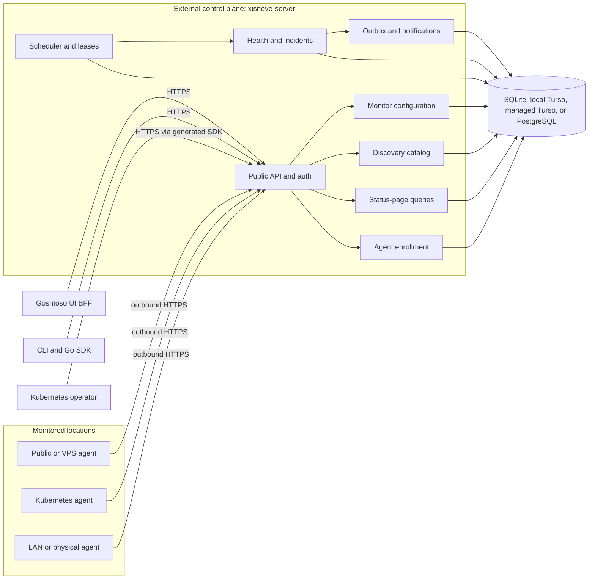

# Xisnove v1 Design

Status: approved architecture, pending written-spec review

Date: 2026-07-24

## Summary

Xisnove is an API-first, self-hosted monitoring service written in Go. It
combines the simple operating model of tools such as Uptime Kuma with a public
OpenAPI contract, a generated Go SDK, a CLI, a Goshtoso-based UI BFF, remote
probing agents, and optional Kubernetes-native reconciliation and discovery.

The v1 architecture is a modular hexagonal control plane backed only by a
relational database. The control plane normally runs outside the infrastructure
it monitors. Lightweight agents make outbound HTTPS connections to lease probe
work, upload results, and publish discovery candidates from otherwise
unreachable locations.

Kubernetes is a client and desired-state surface, not a database. A separate
operator reconciles `Monitor` and `Agent` custom resources through the same
public API used by the CLI and UI. Probe history, incidents, notification
delivery, and audit state remain in SQLite, Turso, or PostgreSQL.

This document defines the complete v1 system design. Implementation will be
split into independently verifiable milestones. The first implementation plan
will cover the smallest end-to-end slice: OpenAPI contract, monitor
configuration, agent enrollment and leasing, an HTTP probe, result ingestion,
health projection, and incident transition on SQLite.

## Goals

- Provide HTTP(S), TCP, and DNS synthetic monitoring from multiple network
  perspectives.
- Keep the public OpenAPI document as the canonical application contract.
- Generate a strict Go server boundary and public Go SDK with `oapi-codegen`.
- Offer a thin CLI and a server-rendered Goshtoso UI BFF without duplicating
  domain rules.
- Run the control plane outside the primary monitored failure domain.
- Reach private, Tailscale-only, physical, VPS, and Kubernetes targets through
  outbound-only agents.
- Discover Kubernetes services and routes with read-only RBAC, then require
  explicit user promotion before monitoring them.
- Support simple single-node deployments and multi-replica managed
  deployments without changing domain semantics.
- Deliver reliable multi-channel notifications with a transactional outbox,
  a pinned Shoutrrr transport, and a first-class Alertmanager adapter.
- Ship supported resources for raw binaries, Docker Compose, OCI images, and
  Kubernetes/Helm deployments.

## Non-goals for v1

- Multi-tenant organizations, workspaces, billing, or hosted SaaS account
  management.
- OIDC or SAML login.
- ICMP probing, because it introduces raw-socket and deployment privilege
  requirements.
- Browser scripting, full transaction monitoring, or arbitrary user-supplied
  probe code.
- Automatic creation of monitors from discovered resources.
- Kubernetes API/etcd as a control-plane persistence backend.
- A CRD for every result, incident, notification, or delivery attempt.
- A Kubernetes Job per probe or notification.
- Multiple public status pages, custom status-page domains, or advanced
  branding.
- Recurring maintenance schedules.
- Scheduled automatic agent-credential rotation.
- Direct Vault, OpenBao, External Secrets Operator, or cloud secret-manager
  API integrations.
- Redis, Kafka, NATS, or another required queue.

## Success criteria

The v1 design is successful when:

1. A control plane running on a cloud VPS or separate cluster can monitor public
   endpoints while agents monitor LAN, Tailscale, physical-node, and Kubernetes
   paths.
2. Losing the monitored homelab does not erase or hide its status, incident
   history, or pending notifications.
3. UI, CLI, operator, and agent functions use only the published API and
   generated SDK contracts.
4. Duplicate scheduling, lease expiry, repeated uploads, process crashes, and
   notification retries do not create duplicate state transitions.
5. SQLite and local Turso operate safely with one active server, while managed
   Turso and PostgreSQL can support multiple stateless server replicas.
6. A Kubernetes discovery agent can catalog useful targets without permission
   to read Secrets or silently create monitors.
7. Releases include verifiable binaries, OCI images, Helm charts, Compose
   resources, CRDs, upgrade notes, checksums, signatures, SBOMs, and provenance.

## Homelab fit

The reference deployment has several distinct failure and reachability domains:

- public DNS and endpoints managed through Cloudflare;
- a Kubernetes cluster containing amd64 and arm64 nodes;
- physical LAN nodes and services;
- VPS nodes reachable over public networks or Tailscale;
- split public/internal DNS and private service addresses;
- an existing Prometheus, Loki, Alloy, and Alertmanager stack.

Xisnove complements that telemetry stack with active reachability and
desired-state monitoring:

- a public/VPS location observes public Cloudflare records and endpoints;
- a LAN location observes physical hosts, private DNS, and Tailscale paths;
- a Kubernetes location discovers cluster services and observes their
  in-cluster routes;
- Alertmanager remains available as a semantic notification sink, while
  Shoutrrr provides embedded delivery channels.

The recommended control plane is outside the home cluster: a cloud service,
external VPS, or separate Kubernetes cluster. It must not depend on the primary
homelab to report that the homelab is unavailable.

## System architecture



The server is one deployable in v1. Its internal modules share a relational
transaction boundary, while ports preserve the option to split deployments
later. Multiple server processes may run the same roles when the database mode
supports them; database leases coordinate schedules and workers.

All probes are agent-executed. A simple installation runs an agent beside the
control plane and assigns it to a public/default Location. Larger installations
add remote agents without changing the scheduling model.

The following rules are architectural invariants:

- OpenAPI is the only application boundary for UI, CLI, SDK, operator, and
  agents.
- Agents have no database credentials and accept no inbound control-plane
  connection.
- The operator never imports server internals or accesses the server database.
- Domain code does not import HTTP, SQL driver, sqlc, Kubernetes, Goshtoso, or
  notification-provider types.
- The relational database is the durable coordination point for every
  asynchronous action.

## Repository and module boundaries

The initial monorepo uses a Go workspace for local development while keeping
independently versionable modules:

```text
/
├── api/
│   └── openapi.yaml
├── cmd/
│   └── xisnove-server/
├── internal/
│   ├── domain/
│   ├── application/
│   ├── ports/
│   └── adapters/
├── sdk/
├── db/
│   ├── migrations/
│   ├── queries/
│   └── generated/
├── agent/
│   ├── go.mod
│   └── cmd/xisnove-agent/
├── operator/
│   ├── go.mod
│   └── cmd/xisnove-operator/
├── cli/
│   ├── go.mod
│   └── cmd/xisnove/
├── ui/
│   ├── go.mod
│   └── cmd/xisnove-ui/
├── charts/
│   ├── xisnove/
│   └── xisnove-edge/
├── deploy/
│   ├── compose/
│   ├── raw/
│   └── systemd/
└── go.work
```

The root module is `github.com/araihu/xisnove`. It owns the server, public
contract, SDK, domain, application use cases, persistence adapters, migrations,
and notification adapters.

Each child module depends only on published packages that it legitimately
consumes:

- `agent/` contains probing, Kubernetes discovery/watch, enrollment, leasing,
  heartbeat, and batched upload.
- `operator/` contains CRDs and controllers and uses only the public SDK.
- `cli/` contains thin commands over the SDK, named API profiles, and human or
  structured output.
- `ui/` contains the Goshtoso BFF, templ/HTMX pages, and UI-specific
  presentation models. It uses only the SDK.

CI tests each module both through `go.work` and with `GOWORK=off`, preventing a
release from accidentally depending on a local workspace replacement.

## Hexagonal ownership

### Domain

The domain layer owns entities, value objects, invariants, and pure state
transitions:

- monitor and location assignment rules;
- typed probe definitions;
- per-location threshold state;
- aggregate monitor health;
- incident opening, severity change, and recovery;
- maintenance suppression decisions;
- notification event identity.

It receives explicit time values and has no global clock, storage, network, or
framework dependency.

### Application

The application layer orchestrates commands and queries:

- monitor and location management;
- agent enrollment, credential rotation, and revocation;
- run scheduling and leasing;
- result ingestion and health projection;
- incident and outbox transactions;
- discovery candidate ingestion and promotion;
- status-page queries;
- retention, aggregation, and cleanup.

Application services depend on ports for persistence, transactions, clock,
random IDs, credential hashing, encryption, notification transport, and audit
recording.

### Adapters

Adapters translate external types at the boundary:

- strict HTTP handlers generated from OpenAPI;
- sqlc repositories and migrations;
- SQLite, Turso, and PostgreSQL drivers;
- cryptography and secret-file loading;
- Shoutrrr and Alertmanager notification transports;
- system clock and ID generation.

Generated API and sqlc types never leak into domain packages.

## Public API and generation

`api/openapi.yaml` is the canonical source. As of 2026-07-24, the pinned
baseline is:

- OpenAPI 3.1.2;
- `oapi-codegen` v2.8.0, the newest stable release verified during design and
  the first release with OpenAPI 3.1 support.

Before implementation begins, automation must recheck the newest stable
`oapi-codegen` version and use the newest OpenAPI revision it officially
supports. Exact tool, runtime, and schema versions are committed. Dependency
automation may propose newer stable pins, but generated diffs require review.

Generation produces:

- strict server interfaces and transport models;
- a public typed Go client;
- an embedded copy of the served contract;
- ergonomic SDK helpers around pagination, authentication, and common options.

Generated code is committed. A clean-generation check fails CI on drift.
Authentication and authorization are explicit middleware; generated security
declarations do not enforce access by themselves.

The one contract contains separately tagged surfaces:

- management;
- public status;
- agent protocol;
- operator provisioning.

Each surface has an explicit security scheme and scope. Operation IDs are
stable, resource names are plural, cursors are opaque, and mutation endpoints
accept idempotency keys where a network retry could otherwise duplicate work.

Errors use `application/problem+json` following RFC 9457. Every problem has a
stable type URI, machine-readable code, correlation ID, and optional field
errors. Internal error strings and secrets are never exposed.

The initial resource families are:

- sessions and API tokens;
- monitors and monitor-location assignments;
- locations and agents;
- enrollment tokens and credential rotation;
- agent work leases, heartbeats, and batched results;
- health summaries and incidents;
- notification channels, routes, deliveries, and replay;
- discovery candidates and promotion;
- maintenance intervals;
- the single public status page.

## Product scope and authentication

V1 is one self-hosted workspace with one bootstrapped local administrator.
There is no default credential. The administrator is created through an
explicit bootstrap command using an interactive password or a rotation-safe
password file.

The control plane issues:

- revocable administrator sessions;
- scoped API tokens for CLI and integrations;
- short-lived, one-time agent enrollment tokens;
- scoped, revocable per-agent credentials;
- a narrowly scoped operator provisioning credential.

High-entropy tokens are displayed once and stored only as verification hashes.
Authorization is deny-by-default and checked per operation.

The UI BFF exchanges administrator credentials with the control plane and keeps
the returned opaque session credential in a Secure, HttpOnly, SameSite cookie.
The credential is never exposed to browser JavaScript. State-changing browser
requests require CSRF protection. The control plane remains the owner of session
expiry and revocation.

OIDC and multi-tenant organizations are deferred, but identity and workspace
IDs remain explicit at application boundaries where doing so avoids a
destructive future migration. V1 does not expose multi-workspace behavior.

## Monitor model

### Monitor

A Monitor contains:

- stable ID, name, description, labels, enabled state, and display order;
- one typed probe definition;
- a fixed-interval schedule, timeout, and bounded jitter;
- failure and recovery thresholds;
- assigned required and optional locations;
- maintenance state;
- public-status-page inclusion.

V1 schedules fixed intervals rather than arbitrary cron expressions. The API
defaults to three consecutive failures before a location becomes failing and
two consecutive successes before it recovers. Both values are configurable per
monitor.

Probe configurations are discriminated OpenAPI schemas, not arbitrary JSON:

- HTTP(S): method, URL, headers, bounded body, redirect policy, expected status
  ranges, body contains/does-not-contain assertions, and TLS-expiry threshold;
- TCP: host, port, connection timeout, and optional bounded send/expect data;
- DNS: resolver selection, name, record type, expected values, and timeout.

Sensitive request values are secret references or encrypted fields and are
redacted from logs and API responses. ICMP is deferred.

### Location

A Location represents a network perspective, not a physical process. Examples
are `public-vps`, `home-k8s`, and `home-lan`.

An Agent belongs to one Location and advertises probe and discovery
capabilities. Multiple agents may serve the same Location for availability.

`MonitorLocation` assigns a Monitor to a Location and marks it required or
optional. Optional location state is visible but does not gate aggregate
health.

### CheckRun and lease

The scheduler creates one CheckRun for each enabled Monitor, assigned Location,
and scheduled time. A unique `(monitor_id, location_id, scheduled_for)` key
prevents duplicates.

A CheckRun progresses through available, leased, and resolved states. The lease
records an agent, attempt number, opaque lease token, and database-time expiry.
A compatible agent obtains work through a bounded REST long-poll. If it crashes
or fails to report, the expired run becomes claimable again. Agents never own
the schedule.

After scheduler downtime, catch-up is bounded per monitor. Missed intervals
beyond the configured catch-up window are summarized as scheduler lag rather
than replayed into an unbounded probe storm.

### ProbeResult

ProbeResult is an immutable observation containing:

- result and run IDs;
- agent and location IDs;
- start, finish, and receipt timestamps;
- outcome and structured error class;
- total latency and protocol-specific timings;
- assertion outcomes;
- a bounded, redacted diagnostic sample.

The result ID is the ingestion idempotency key. The first valid result resolves
the run. Repeated or late uploads return a successful duplicate acknowledgement
and cannot trigger a second projection or incident transition.

Agents batch result uploads and retain a bounded in-memory retry queue until the
server acknowledges each result. A process crash may discard that queue, after
which the lease expires and the run is executed again. A durable offline agent
spool is deferred.

## Health and incidents

Each MonitorLocation has a durable health projection. Results apply the
configured consecutive failure and recovery thresholds. A location becomes
stale when it misses two expected schedules plus the maximum probe/lease
timeout; the exact deadline is stored so all replicas agree.

Required locations roll up deterministically in this order:

1. Any required location missing or stale after its grace period produces
   `unknown`.
2. All required locations passing produces `up`.
3. All required locations failing produces `down`.
4. A fresh mixture of passing and failing required locations produces
   `degraded`.

Initial `pending` state does not notify. Optional locations are reported but do
not change the aggregate state.

There is at most one active Incident per Monitor. A transition from a healthy
state to `degraded`, `down`, or post-grace `unknown` opens an Incident. State and
severity changes append IncidentEvents to it. `down` is critical;
`degraded` and agent-unavailable `unknown` are warning states. Recovery to `up`
closes the Incident.

Health projection, Incident transition, audit entry, and all required
notification outbox records commit in one transaction. Current projections are
rebuildable from immutable results, but are stored for efficient reads.

## Scheduling, leasing, and failure handling

The scheduler, agent work dispatcher, result projector, retention worker, and
notification worker all use database-backed leases or atomic claims. No
in-memory ownership is required for correctness.

All claims use database time, short transactions, and compare-and-set updates.
Workers are safe to run in every eligible server replica. A crash requires no
cleanup: leases expire and another worker resumes the work.

Shutdown behavior is:

1. fail readiness and stop claiming new work;
2. stop accepting new long-polls;
3. allow bounded in-flight work to finish;
4. release a lease when safe, otherwise let it expire;
5. close network listeners and database connections.

Liveness detects a wedged process. Readiness fails when required persistence or
schema compatibility is unavailable.

## Persistence profiles

All persistent control-plane state is relational. Kubernetes API/etcd is never
a datastore adapter.

### SQLite

- Uses a CGO-free `database/sql` driver and WAL mode.
- Supports one active Xisnove server process in v1.
- Uses bounded write transactions and cleanup batches.
- Has a documented online-safe backup and restore process.
- Is the default for raw and Compose installations.

### Local Turso Database

- Uses `tursogo` through `database/sql`.
- Uses the Rust Turso Database engine for local or explicit push/pull sync.
- Shares the SQLite-compatible schema and sqlc query family.
- Supports one active Xisnove server process in v1.
- Is marked evolving until the upstream engine and required SQL surface pass
  the full Xisnove persistence conformance suite.
- Sync is optional and is not used as a distributed lease coordinator.

### Managed Turso Cloud

- Uses `libsql-client-go` for remote `database/sql` access.
- Supports multiple stateless Xisnove server replicas against one managed
  database.
- Uses the SQLite-compatible schema and sqlc query family.
- Assumes Turso Cloud's current production libSQL engine and serialized writer;
  work claims and incident transactions remain short and retry lock conflicts.
- Does not assume local sync replicas can coordinate leases.
- Treats Turso Cloud primary/replica instances, durability, and failover as
  managed-service responsibilities. Xisnove uses the database endpoint and
  does not couple scheduling correctness to the provider's replica topology.

Turso Cloud and the local Rust Turso Database engine are distinct persistence
profiles. As of the design date, Turso Cloud runs libSQL and plans to integrate
the newer engine later.

### PostgreSQL

- Uses pgx and a separately generated sqlc package.
- Supports multiple API, scheduler, projection, and notification worker
  replicas.
- Is the reference self-managed high-availability profile.
- Uses PostgreSQL-native atomic claiming while preserving the application-port
  behavior shared by every adapter.

There are two generated SQL families: SQLite-compatible and PostgreSQL.
Adapter mapping prevents driver-specific UUID, timestamp, JSON, and nullable
types from escaping into the domain.

Every schema uses a normal `schema_migrations` table rather than
`PRAGMA user_version`, keeping migration behavior portable to Turso Cloud.

## Notification architecture

Xisnove owns notification semantics:

- routing by monitor labels, event type, and severity;
- template selection and rendering;
- deduplication;
- timeout and retry policy;
- audit history;
- secret references;
- manual replay.

The embedded multi-channel transport is
`github.com/nicholas-fedor/shoutrrr`, pinned to a reviewed stable release. The
design baseline is v0.16.2. Before implementation, the newest stable fork
release is reviewed and pinned.

Shoutrrr remains behind a `NotificationTransport` port. Its sender API does not
provide `context.Context`, so Xisnove enforces injected HTTP-client timeouts,
worker deadlines, bounded concurrency, and egress policy outside the library.

Alertmanager is a separate first-class semantic adapter rather than a Shoutrrr
URL. This lets the homelab continue using its existing routing, inhibition, and
Discord integration.

For each IncidentEvent, routing creates immutable outbox rows containing a
render-input snapshot. A uniqueness key across event, route, and channel
prevents duplicates. Workers claim due rows, record every attempt, and retry
transient failures with capped exponential backoff and jitter. Permanent
failure is visible and manually replayable. Provider failure never rolls back
or hides the Incident.

Because every supported backend is relational, the transactional outbox is
mandatory. Kubernetes Jobs are not used for notification delivery.

## Maintenance and retention

V1 supports one-off and indefinite maintenance intervals. Probes continue and
health continues to update, but notification delivery is suppressed. If a
Monitor remains unhealthy when maintenance ends, Xisnove emits a fresh
transition so the condition is not silently lost.

Recurring maintenance schedules are deferred.

Default retention is:

- raw ProbeResults: 30 days;
- daily uptime aggregates: 13 months;
- Incident and IncidentEvent history: retained until explicit deletion;
- delivery attempts and audit events: retained with their Incident unless an
  administrator applies a documented privacy cleanup.

Aggregation and cleanup use bounded batches to avoid long SQLite or libSQL
write locks.

V1 exposes one public status page. Only explicitly selected Monitors appear.
The page shows current aggregate state, active incidents, and recent uptime
history. Multiple pages, custom domains, and advanced branding are deferred.

## Agent protocol and security

The single `xisnove-agent` binary advertises independently enabled
capabilities:

- HTTP, TCP, and DNS probe execution;
- Kubernetes discovery;
- Kubernetes watch-derived catalog updates.

An administrator or operator creates a short-lived one-time enrollment token.
The agent exchanges it for a scoped, revocable credential and never receives
database access.

The steady-state protocol is:

1. heartbeat with identity, version, location, capabilities, and credential
   generation;
2. bounded REST long-poll for compatible work;
3. local probe execution under agent policy;
4. idempotent batched result upload;
5. discovery-candidate upsert batches when discovery is enabled.

Agent policy constrains schemes, ports, CIDRs, redirect count, DNS
re-resolution, timeout, response bytes, concurrency, and upload batch size.
LAN locations may explicitly allow private address ranges. Cloud metadata and
link-local destinations are denied by default. Redirects are revalidated
against the same policy to limit SSRF.

When a probe needs a credential, the control plane resolves or decrypts it only
while building the leased work payload. It sends the minimum required value to
the assigned agent over authenticated HTTPS. The agent keeps it only for the
run and never writes it to logs, discovery records, results, or local storage.

Probe results retain structured assertion failures and bounded redacted
samples, never entire response bodies. Request and response secrets are
redacted before logging or persistence.

## Secrets and credential rotation

V1 secret inputs support:

- environment variables;
- files that can be reread safely after atomic replacement;
- Helm `existingSecret` references.

Vault Agent, OpenBao Agent, CSI drivers, and External Secrets Operator may
materialize files or Kubernetes Secrets. Xisnove does not call their APIs in v1.
A future `SecretResolver` port may add direct providers without changing
domain or application behavior.

Notification configuration is encrypted at rest using versioned AEAD. The
master key is supplied outside the database and supports a rotation procedure.
Database, master-key, provisioner, and notification secrets are never embedded
in CRD status or logs.

API and agent credentials are individually revocable. Operator-managed agent
rotation is explicit in v1:

1. create a new credential generation while the old credential remains valid;
2. atomically update the operator-owned Secret;
3. let kubelet update the full mounted Secret file;
4. let the agent reread and heartbeat with the new generation;
5. revoke the old credential after confirmation or a documented overlap
   deadline.

Scheduled automatic rotation is deferred.

## Kubernetes operator and CRDs

The optional operator reconciles namespaced
`monitoring.xisnove.io/v1alpha1` resources through the generated public SDK.
It uses its own ServiceAccount and accepts a narrowly scoped control-plane
provisioning credential through `existingSecret`.

### Monitor CRD

`Monitor.spec` contains the Kubernetes representation of a supported Monitor
and its location selection. The controller creates or updates only the remote
Monitor owned by that resource.

`Monitor.status` is bounded:

- `observedGeneration`;
- remote `externalID`;
- aggregate health and last transition time;
- standard `Ready`, `Synced`, and `Degraded` conditions;
- the last reconciliation error in a bounded condition message.

Health is encoded in status and conditions. There is no Alert CRD. Results,
Incident history, delivery attempts, and secrets remain in the control plane.

A finalizer deletes or revokes the remote object owned by the CR. Failure to
reach the control plane causes retry with backoff. A documented annotation-based
force-removal escape hatch allows recovery when the remote control plane is
permanently gone. The operator never deletes a Monitor it does not own.

### Agent CRD

An `Agent` CR defines location, enabled capabilities, permitted discovery
namespaces, resource policy, and workload settings. The controller:

- registers or updates the remote Agent identity;
- materializes its credential into an operator-owned namespaced Secret;
- manages a namespaced Deployment;
- performs explicit overlap-safe credential rotation;
- reports registration, workload, and heartbeat conditions.

The agent mounts the complete Secret file. Its ServiceAccount has no Secret
read permission. The operator has separate, namespaced permissions required to
manage its owned Secret and Deployment.

### Discovery RBAC and flow

When enabled, the edge chart grants read-only list/watch access, limited by
configuration, to:

- Services;
- EndpointSlices;
- Ingresses;
- Gateways;
- HTTPRoutes;
- non-secret certificate metadata.

The agent cannot read Secret objects. It normalizes resource UID, namespace,
name, labels, target, protocol, and network perspective into stable
DiscoveryCandidates and upserts them through the API.

A candidate becomes a Monitor only through an explicit API, CLI, UI, or
approved policy action. When a source disappears, its candidate becomes stale.
A promoted Monitor remains intact and retains source provenance and a drift
hint.

Operator downtime pauses reconciliation but does not stop the control plane,
existing agents, monitors, or notification workers.

## UI BFF and Goshtoso

The `xisnove-ui` module is a separate server-rendered BFF:

- templ and HTMX render pages and fragments;
- all control-plane access uses the public SDK;
- no database driver or sqlc package is present;
- API credentials are never exposed to browser JavaScript;
- Goshtoso's bundled `assets.Handler()` is mounted directly at `/assets/`;
- runtime operation needs no CDN.

Xisnove-specific monitor cards, health timelines, incident views, discovery
workflows, and status-page views live in `ui/`.

If Xisnove needs a genuinely generic UI primitive that Goshtoso lacks, that
primitive is designed and tested upstream in `araihu/goshtoso`, released, and
then consumed at a pinned version. Application-specific composites do not
expand Goshtoso's public surface.

## CLI

The `xisnove` CLI is a thin SDK consumer. It supports:

- named API profiles and secure token lookup;
- monitor, location, agent, incident, notification, discovery, and status-page
  commands;
- human-readable tables;
- stable JSON or YAML output for automation;
- explicit idempotency keys for retryable mutations.

The CLI contains presentation and command orchestration only. Validation shared
with other clients lives in the OpenAPI contract; domain rules live in the
server.

## Deployment resources

### Helm

Two charts keep the control plane independent from monitored clusters:

- `charts/xisnove`: server and UI, optional colocated public agent, and either
  a SQLite PVC for one replica or managed Turso/PostgreSQL configuration for
  multiple replicas;
- `charts/xisnove-edge`: operator, CRDs, discovery RBAC, and agent for a
  monitored cluster, pointing outward to an existing control plane.

Ingress or Gateway API, TLS, NetworkPolicy, PDB, ServiceMonitor, resource
requests/limits, topology spread, and `existingSecret` references are
configurable rather than required.

The chart may execute one bounded schema-migration Job during an upgrade. Jobs
are not used for routine probes or notifications. Migrations follow
expand/migrate/contract rules so documented rolling upgrades can run compatible
old and new application images during the transition.

### OCI

Releases publish signed multi-architecture images for:

- `xisnove-server`;
- `xisnove-ui`;
- `xisnove-agent`;
- `xisnove-operator`.

Images target Linux amd64 and arm64. Helm charts are also published as OCI
artifacts.

### Raw binaries

Releases provide versioned binaries for server, UI, CLI, agent, and operator,
with checksums, signatures, sample configuration, and systemd units where
applicable. Server, UI, agent, and operator target Linux amd64/arm64. The CLI
also targets macOS and Windows.

### Docker Compose

Compose starts server, UI, and a colocated agent with SQLite by default, offers
a PostgreSQL profile, and includes an additional remote-agent example. Managed
Turso is configured through environment or secret files rather than emulated
locally.

## Migrations, backups, and upgrades

A versioned migration command runs explicitly. Startup refuses an incompatible
schema rather than applying unbounded migrations implicitly.

Each database profile documents:

- initial creation;
- online-safe backup;
- restore to a fresh instance;
- migration ordering;
- rollback limitations;
- a restore smoke test.

One project release version labels every component and compatibility matrix.
The public API and generated SDK also follow semantic compatibility rules.
Breaking API changes require a new major API version; deprecated operations
remain for a documented support window.

## Observability

Every service emits structured JSON logs with correlation, run, monitor,
location, agent, incident, and delivery IDs where relevant.

The server exposes:

- `/livez`;
- `/readyz`;
- `/metrics`;
- optional OpenTelemetry traces.

Metrics include:

- monitor state and transitions;
- probe outcome and latency;
- scheduler lag and bounded catch-up;
- lease claims, expiries, and retries;
- agent heartbeat age;
- result ingestion duplicates;
- outbox age and delivery attempts;
- database pool, transaction, and migration health.

The agent and operator expose their own health and Prometheus metrics.
Profiling endpoints are disabled by default and, when enabled, bind only to a
configured administrative listener.

## Testing strategy

### Domain and application

- table and property tests for health rollup truth tables;
- incident state-machine tests;
- fake-clock scheduling and stale-location tests;
- maintenance and retention behavior;
- token scope, secret redaction, and SSRF policy tests;
- retry and idempotency invariants.

### API and generated consumers

- OpenAPI lint and validation;
- compatibility and breaking-change gates;
- strict server request/response tests;
- generated SDK, CLI, UI, agent, and operator contract tests;
- stable RFC 9457 problem fixtures;
- generated-file cleanliness.

### Persistence conformance

The same behavioral suite runs against:

- SQLite on every pull request;
- local Turso on every pull request;
- PostgreSQL through ephemeral test infrastructure on every pull request;
- a real managed Turso database in protected scheduled CI and as a release
  gate.

The suite covers atomic claims, competing replicas, lease expiry, transaction
rollback, duplicate result ingestion, one-active-incident enforcement,
transactional outbox creation, delivery replay, migrations, cleanup batching,
and restore smoke tests.

Go race tests run for concurrency-sensitive packages. Fault tests terminate
workers between claim and commit to prove lease recovery.

### Kubernetes

- controller unit tests with fake SDK boundaries;
- `envtest` reconciliation, status, ownership, and finalizer tests;
- kind end-to-end tests for CRD installation, RBAC, discovery, Agent workload
  creation, Secret materialization, overlap-safe rotation, and network loss;
- assertions that the discovery ServiceAccount cannot read Secrets;
- assertions that candidate deletion never deletes a promoted Monitor.

### UI and system

- handler and component tests for full pages and HTMX fragments;
- accessibility checks on primary workflows;
- Playwright journeys for login, monitor creation, incident inspection,
  candidate promotion, notification configuration, and the public status page;
- end-to-end agent crash, duplicate upload, provider timeout, and control-plane
  restart scenarios.

Representative homelab acceptance tests cover public Cloudflare endpoints,
private/Tailscale DNS, physical hosts, Kubernetes Ingress and Gateway API
discovery, and Alertmanager delivery.

## Release and supply chain

GitHub Actions:

- test every Go module with workspace mode enabled and disabled;
- lint and verify the OpenAPI contract;
- verify generated code and sqlc output are clean;
- build reproducible multi-architecture binaries and OCI images;
- scan dependencies and images;
- emit SBOMs and provenance;
- sign artifacts and OCI references with cosign;
- publish SHA-256 checksums;
- publish Helm OCI artifacts and GitHub release assets.

The release bundle contains CRDs, both Helm charts, Compose resources, raw
manifests, systemd units, example configuration, migration tools, compatibility
matrix, and upgrade notes.

Dependencies, Go toolchains, code generators, and GitHub Actions are pinned.
Reviewed automation proposes stable updates.

## Delivery milestones

This system is too broad for one safe implementation change. Work proceeds as
dependent, end-to-end milestones:

1. **Foundation and first observation:** repository modules, OpenAPI 3.1
   contract, generated server and SDK, SQLite schema, local administrator,
   Monitor/Location/Agent APIs, enrollment, leased HTTP work, result ingestion,
   health projection, Incident transition, and contract/conformance tests.
2. **Protocol and persistence breadth:** TCP/DNS/TLS behavior, batched uploads,
   scheduler recovery, PostgreSQL, local Turso, managed Turso, migrations,
   backup/restore, and multi-replica tests.
3. **Reliable notification and operations:** transactional outbox workers,
   Shoutrrr, Alertmanager, routing, maintenance, retention, metrics, tracing,
   readiness, and graceful shutdown.
4. **Human clients:** CLI, Goshtoso UI BFF, single public status page, discovery
   catalog workflow, and browser end-to-end tests.
5. **Kubernetes edge:** CRDs, operator, agent Secret materialization, read-only
   discovery, promotion, Helm edge chart, and kind tests.
6. **Distribution and hardening:** control-plane Helm chart, Compose, raw
   resources, multi-architecture release automation, signing, SBOMs,
   provenance, upgrade drills, and representative homelab acceptance.

Each milestone must leave the repository buildable, testable, documented, and
usable for its completed slice. The next planning step covers milestone 1 only.

## Risks and accepted trade-offs

- **One server deployable can grow large.** Hexagonal package boundaries and
  internal ports preserve clarity without imposing an early distributed-system
  tax.
- **SQLite-compatible backends have a constrained write path.** Short
  transactions, bounded workers, and adapter conformance tests protect v1;
  PostgreSQL is available for write-heavy self-managed installations.
- **Managed Turso and local Turso have different engines and semantics.** They
  are separate runtime profiles even though they share SQL generation.
- **Long-poll is less push-oriented than a streaming protocol.** It is simpler
  through proxies, firewalls, raw deployments, and Kubernetes, and is
  sufficient for v1 probe intervals.
- **Agent retry queues are not indefinitely durable.** Idempotency and lease
  expiry preserve correctness; a durable offline spool can be added if field
  experience requires it.
- **Shoutrrr broadens channels but does not own reliability.** Keeping it behind
  a port and retaining outbox state in Xisnove limits provider and library risk.
- **Reflecting health into CR status duplicates a projection.** The bounded
  summary improves Kubernetes usability without placing history or delivery
  workload in etcd.
- **Two Helm charts add release surface.** They make the critical separation
  between external control plane and monitored cluster explicit and reusable.

## Deferred evolution surfaces

The design intentionally leaves ports or versioned contracts for:

- OIDC and multiple workspaces;
- multiple and custom-domain status pages;
- ICMP and more advanced probes;
- recurring maintenance;
- scheduled credential rotation;
- a durable agent offline spool;
- direct secret-manager resolvers;
- policy-driven discovery promotion;
- alternative notification transports;
- separately scalable control-plane processes;
- later OpenAPI and generator revisions.

None of these are required for the v1 schema or deployment model to function.

## References

- [OpenAPI Specification 3.1.2](https://spec.openapis.org/oas/v3.1.2.html)
- [`oapi-codegen` v2.8.0 release](https://github.com/oapi-codegen/oapi-codegen/releases/tag/v2.8.0)
- [Turso Go SDK reference](https://docs.turso.tech/sdk/go/reference)
- [Turso Cloud architecture](https://docs.turso.tech/turso-cloud)
- [Turso Cloud database instances](https://docs.turso.tech/api-reference/databases/list-instances)
- [Turso Cloud durability guarantees](https://docs.turso.tech/cloud/durability)
- [Nicholas Fedor's Shoutrrr fork](https://github.com/nicholas-fedor/shoutrrr)
- [Shoutrrr v0.16.2 documentation](https://shoutrrr.nickfedor.com/v0.16.2/)
- [RFC 9457: Problem Details for HTTP APIs](https://www.rfc-editor.org/rfc/rfc9457)
